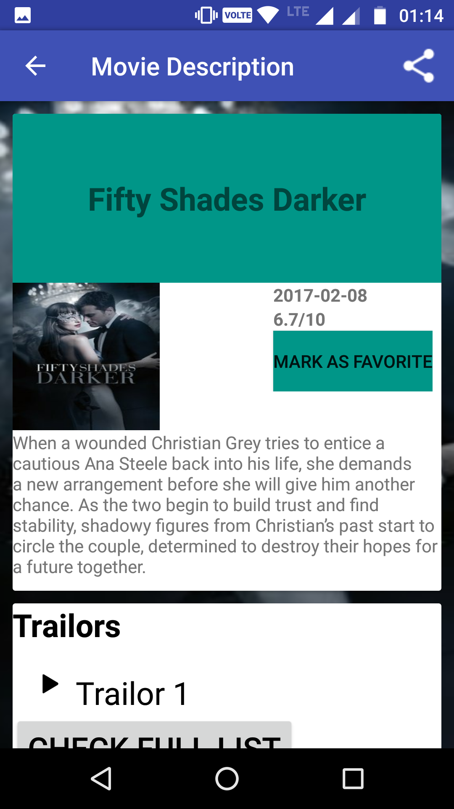
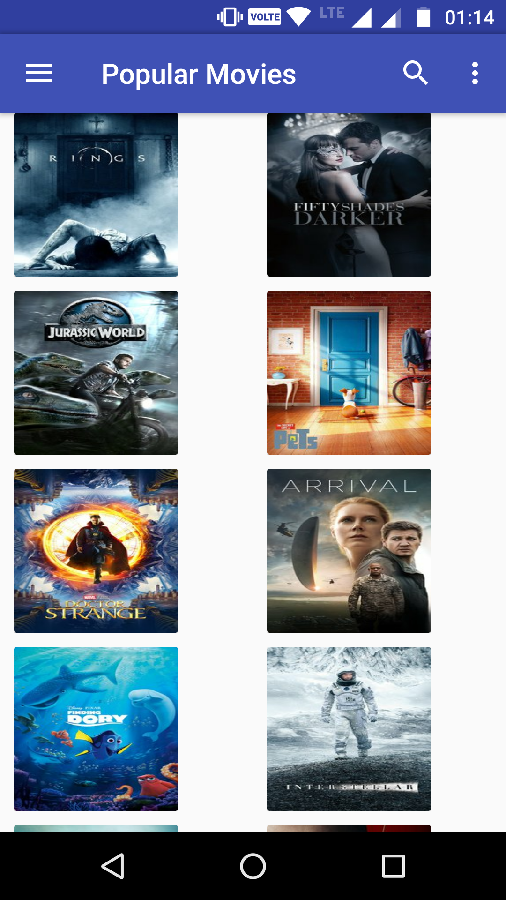

# Popular Movies Android App ( Udacity Android Nanodegree Project )

### Introduction

An Android App optimized for tablets, which help users discover popular and top-rated movies, play trailors
and read user reviews.

### Screenshots

### API Used

The movies are fetched from "themoviedb.org" api from where the user gets the popular and the top-rated movies
depending on the option selected by the user in the settings menu.

### Libraries Used
  
  1. Picasso
  2. Volley
  3. ButterKnife

### Contribution

Feel free to contribute and in case of any doubt reach me via email: *arpitdec5@gmail.com*
